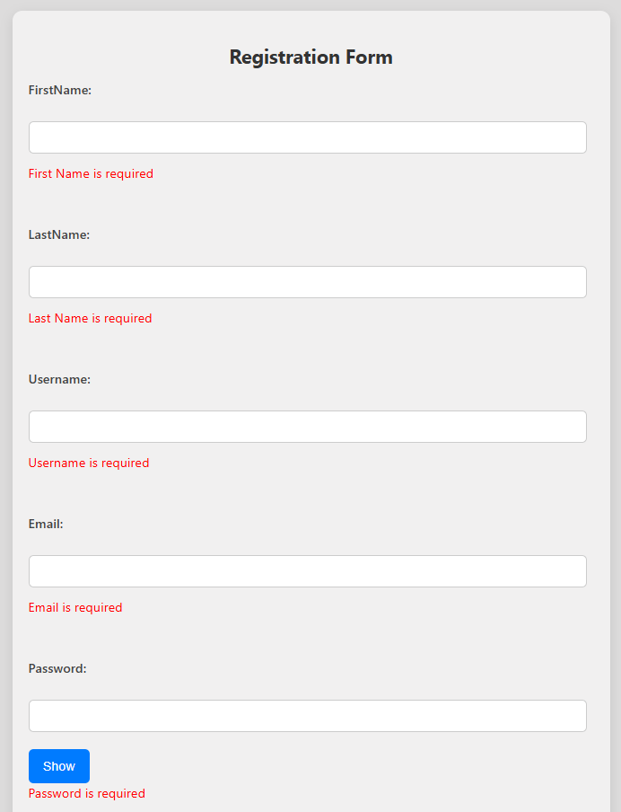
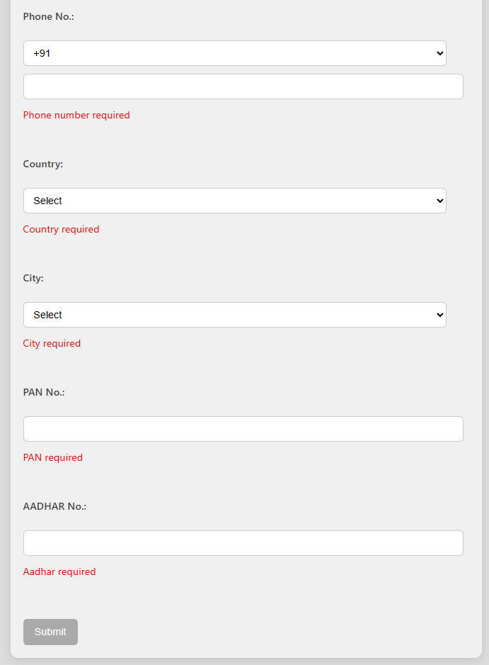
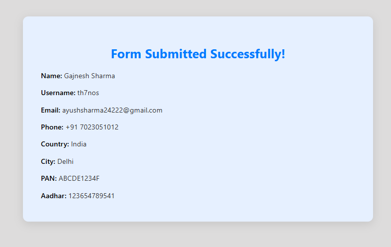

#  React Form with Validation and Routing

A beginner-friendly React application that implements a form with field validation, dynamic dropdowns (country → city), show/hide password toggle, and redirection to a success page upon submission. Built **without third-party form libraries**.

---

##  Features

-  Form field validation with custom error messages
-  Show/Hide password toggle
-  Country → City dynamic dropdown
-  Submit button is disabled until form is valid
-  Redirect to success page and display all entered data
-  Styled using basic CSS for clean and user-friendly UI

---

##  Validated Form Feilds
| Field         | Validation                           |
| ------------- | ------------------------------------ |
| First Name    | Required                             |
| Last Name     | Required                             |
| Username      | Required                             |
| Email         | Required & valid format              |
| Password      | Required                             |
| Phone         | Required                             |
| Country       | Required                             |
| City          | Required (based on selected country) |
| PAN Number    | Required                             |
| Aadhar Number | Required                             |


##  Screenshots


### 📋 Form Page




### ✅ Success Page



---

## 📂 Project Structure

react-form/
├── public/
│ └── index.html
├── src/
│ ├── App.js
│ ├── index.js
│ ├── FormPage.js
│ ├── SuccessPage.js
│ └── styles/
│ ├── FormPage.css
│ └── SuccessPage.css
├── package.json
├── README.md
└── .gitignore


## ⚙️ How to Run Locally

### 📌 Prerequisites

- Node.js and npm installed on your system
- Git installed

### 🔧 Setup Steps

#### 1. Clone the Repository

```bash
git clone https://github.com/AYUSH-SAMADHIYA/Celebal-Technologies
npm start

This runs the app in development mode at:
http://localhost:3000
