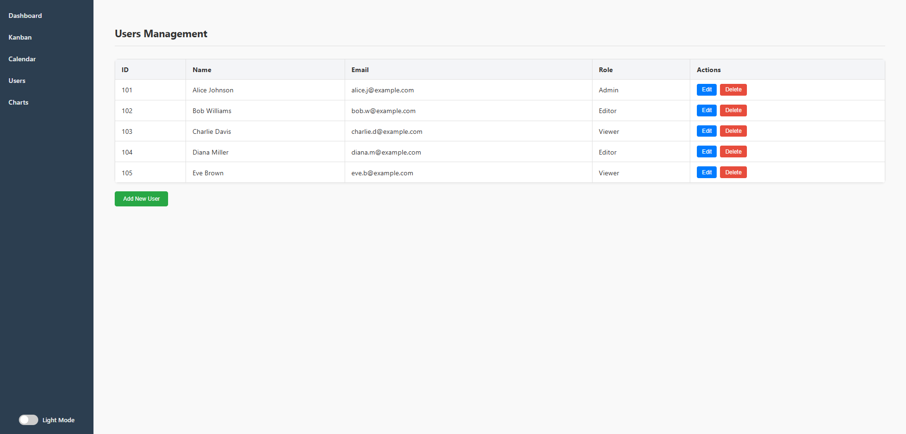

# React Dashboard Application

This is a multi-page dashboard application built with React, created using `create-react-app`. It features a clean sidebar navigation and several functional pages: a dashboard overview with KPI cards, a Kanban board for task management, an interactive calendar for events, a user management table, and a charts page for data visualization.

## Features

* **Dashboard:** Displays key performance indicators (KPIs) for users, tasks, and upcoming events.
* **Kanban Board:** A draggable task management board with "To Do", "In Progress", "Done", and "Blocked" columns, allowing basic task movement and addition.
* **Calendar:** An interactive event calendar powered by `react-big-calendar`, supporting event creation and deletion.
* **Users:** A basic table displaying user information, simulating data fetching.
* **Charts:** Visualizes data using Bar, Line (Area), and Pie charts powered by `Chart.js` and `react-chartjs-2`.
* **Responsive Design:** Basic responsiveness applied to ensure usability across different screen sizes.

## Technologies Used

* **React:** Frontend JavaScript library for building user interfaces.
* **React Router DOM:** For declarative routing within the application.
* **Chart.js / React Chart.js 2:** For creating dynamic and interactive charts.
* **React Big Calendar:** For a rich and interactive calendar interface.
* **Moment.js:** A lightweight JavaScript date library (used by `react-big-calendar`).
* **CSS:** For styling and layout.

## Folder Structure

my-dashboard-app/
├── public/
│   ├── index.html
│   └── ...
├── src/
│   ├── components/
│   │   ├── KPICard.js
│   │   └── KPICard.css
│   ├── pages/
│   │   ├── Calendar.js
│   │   ├── Charts.js
│   │   ├── Kanban.js
│   │   ├── Dashboard.js
│   │   ├── Users.js
│   │   ├── Kanban.css
│   │   ├── Charts.css
│   │   └── Calendar.css (optional, if custom styles added)
│   ├── App.js
│   ├── App.css
│   ├── index.js
│   └── index.css (default create-react-app)
├── .gitignore
├── package.json
├── README.md


## Screenshots





## How to Start

Follow these steps to get the project up and running on your local machine.

### Prerequisites

* Node.js (LTS version recommended)
* npm (comes with Node.js) or yarn

### Installation and Setup

1.  **Clone the repository:**
    ```bash
    git clone https://github.com/AYUSH-SAMADHIYA/Celebal-Technologies/tree/main/Assi-3/my-dashboard-app
    cd my-dashboard-app
    ```

### Running the Application

1.  **Start the development server:**
    ```bash
    npm start
    ```
    or
    ```bash
    yarn start
    ```
2.  **Open in browser:**
    The application will automatically open in your default web browser at `http://localhost:3000`. If it doesn't, navigate there manually.
