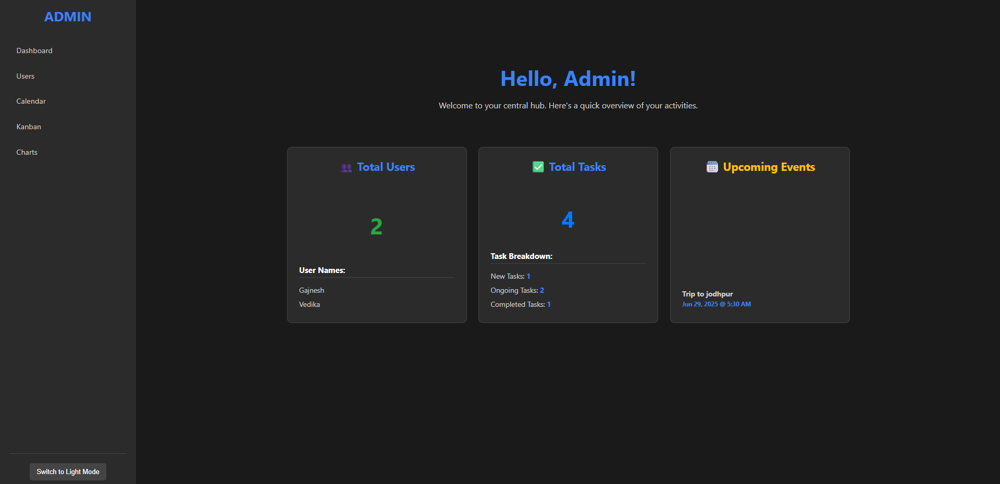
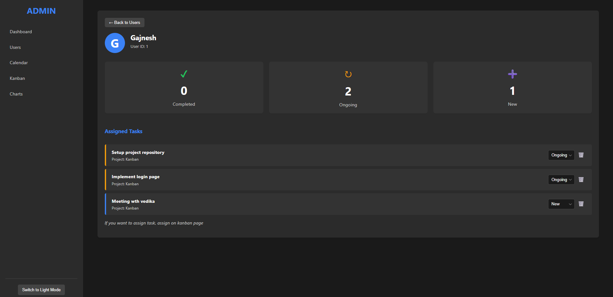
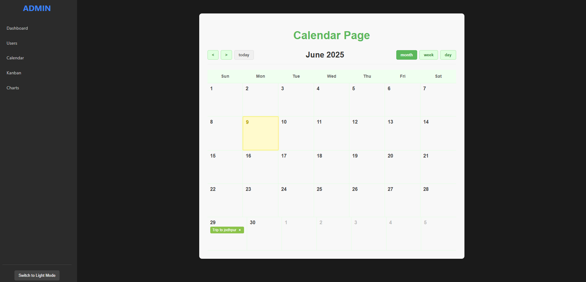
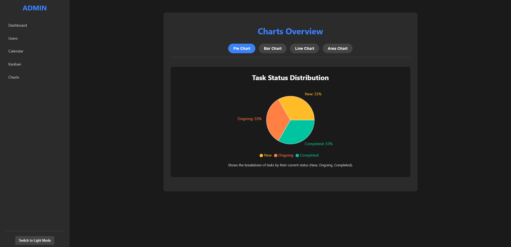
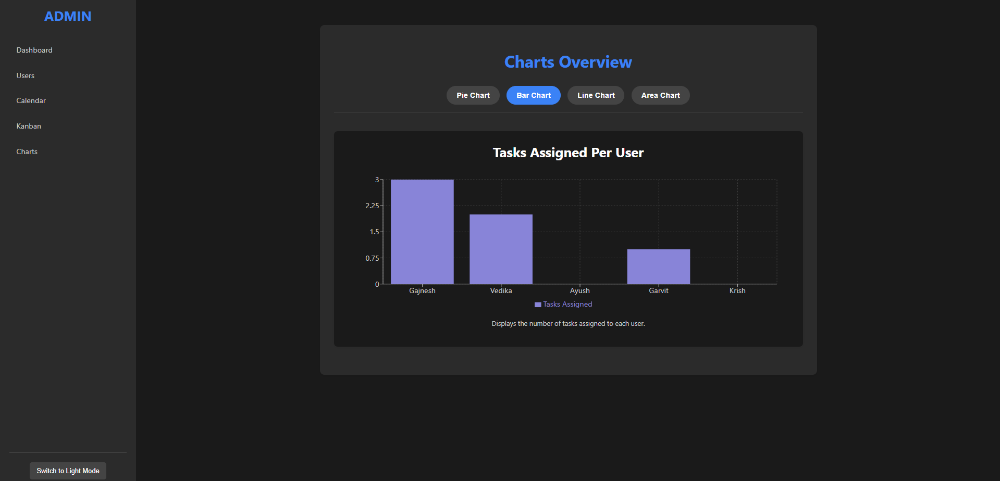

# My Dashboard App

## Project Overview

This is a comprehensive web-based dashboard application built with React, designed to help individuals or small teams manage users, tasks, and events efficiently. It features a responsive UI, intuitive navigation, and data persistence using Local Storage, ensuring that your data remains available across browser sessions.

## Features

* **Dashboard Overview:** Get a quick glance at key metrics like total users, total tasks (broken down by status: New, Ongoing, Completed), and upcoming events.
* **User Management:**
    * Add new users with names.
    * View detailed user profiles showing assigned tasks and their statuses.
    * Check , update and delete tasks of users from their profile page.
    * Delete users (which also unassigns their tasks from the Kanban board).
* **Kanban Board:**
    * A visual task management system with "To Do," "In Progress," and "Done" columns.
    * Easily move tasks between columns with left/right arrows.
    * Can assign task to any specific user.
    * Delete tasks.
* **Calendar:**
    * View events in Month, Week, or Day modes.
    * Navigate through dates (previous, next, today).
    * Add new events for specific dates.
    * Delete existing events.
* **Charts & Analytics:**
* **Persistent Data:** All tasks events are stored in your browser's Local Storage, so your data persists even after you close and reopen the browser.
* **Toast Notifications:** Provides real-time feedback for actions like adding/deleting tasks, and moving tasks.

## Screenshots

### Dashboard Overview


### User Page Overview


### User Profile Overview


### Kanban Board


### Calendar Page Overview


### Chart Page Overview




## Technologies Used

* **React:** Frontend JavaScript library for building user interfaces.
* **React Router DOM:** For declarative routing in React applications.
* **date-fns:** A modern JavaScript date utility library.
* **Local Storage:** For client-side data persistence.
* **ESLint:** For code quality and consistency.
* **CSS:** For styling and layout.


## Folder Structure

my-dashboard-app/
├── public/
│   ├── index.html
│   └── favicon.ico
│   └── ... (other public assets)
├── src/
│   ├── assets/
│   │   ├── profile.jpg          
│   │   └── dashboard-overview.png
│   │   └── kanban-board.png    
│   │   └── ... (other images/icons)
│   ├── components/
│   │   ├── modals/
│   │   │   ├── AddEventModal.js
│   │   │   ├── AddUserModal.js
│   │   │   ├── AssignTaskModal.js
│   │   │   └── Modal.css         # Common modal styles
│   │   ├── toast/
│   │   │   ├── ToastNotification.js
│   │   │   └── ToastNotification.css
│   |   | └── ... (other general-purpose components)
│   ├── pages/
│   │   ├── CalendarPage.js
│   │   ├── CalendarPage.css
│   │   ├── ChartPage.js
│   │   ├── ChartPage.css
│   │   ├── DashboardPage.js
│   │   ├── DashboardPage.css
│   │   ├── KanbanPage.js
│   │   ├── KanbanPage.css
│   │   ├── PageStyles.css      
│   │   ├── UserPage.js
│   │   └── UserPage.css
│   ├── App.js                  
│   ├── App.css                   
│   ├── index.js               
│   └── index.css                 
├── .gitignore
├── package.json
├── package-lock.json
├── README.md


## How to Run the App

Follow these steps to get a copy of the project up and running on your local machine for development and testing purposes.

### Prerequisites

Make sure you have the following installed on your machine:

* [Node.js](https://nodejs.org/en/) (LTS version recommended)
* [npm](https://www.npmjs.com/) (Node Package Manager, usually comes with Node.js) 
### Installation

1.  **Clone the repository:**
    ```bash
    git clone https://github.com/AYUSH-SAMADHIYA/Celebal-Technologies/Assi-3/my-dashboard-app
    cd my-dashboard-app
    ```

2.  **Install dependencies:**
    ```
    npm install
    ```

### Running the Development Server

1.  **Start the application:**
  
    ```
    npm start
    ```
2.  The application will open in your default web browser at `http://localhost:3000`.


## Usage

* Navigate through the app using the top navigation bar to access Dashboard, Users, Kanban, Calendar, and Charts pages.
* On the **Users** page, add new users. Click on a user to view their profile and update tasks.
* On the **Kanban** board, assign new tasks to users and move them between columns.
* On the **Calendar** page, add and manage events.
* The **Dashboard** and **Charts** pages will automatically reflect changes made on the Users and Kanban pages.
