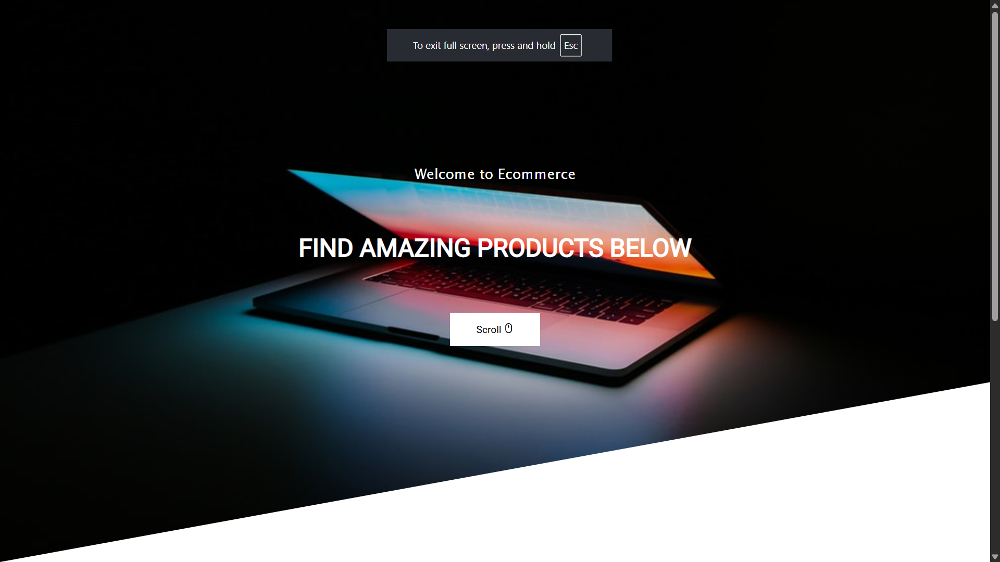
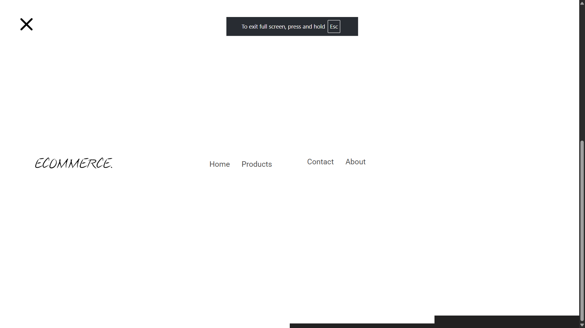
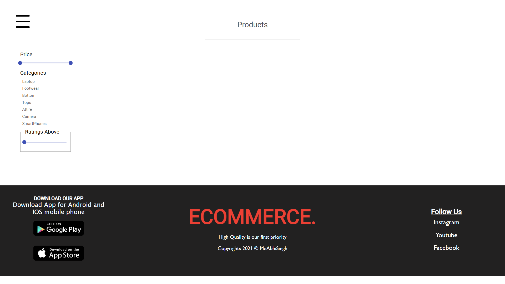

# 🛒 E-Commerce Web Application

A full-featured E-Commerce Store built using the **MERN stack** (MongoDB, Express.js, React, Node.js). This application offers seamless navigation, a responsive UI, and advanced shopping features including customizable product views, dynamic cart management, a secure checkout process, and payment gateway integration.

---

## 🚀 Features

- 📦 Product Listings with List/Grid toggle
- 🔍 Product Search functionality
- 🛒 Add to Cart / Remove from Cart
- ✅ Checkout Process
- 💳 Payment Gateway Integration
- 👨‍💻 Admin-ready backend API
- ⚡ Fast and responsive UI 

---

## 📂 Folder Structure

The project follows a standard feature-sliced design pattern to keep the code organized, scalable, and easy to maintain.

```
├── backend
│ ├── config
│ ├── controllers
│ ├── middleware
│ ├── models
│ ├── routes
│ ├── utils
│ ├── app.js
│ └── server.js
├── frontend
│ ├── public
│ ├── src
│ ├── .env
│ ├── package.json
│ └── README.md


```
---

## ⚙️ Installation

1️⃣ **Clone the repository:**

```bash
git clone https://github.com/AYUSH-SAMADHIYA/Celebal-Technologies/tree/main/Assi-7/E-Com
cd E-Com
```

2️⃣ **Install dependencies**
```bash
npm install
```

4️⃣ **Run the development server**
```bash
npm run dev
```

**Visit http://localhost:5173 to see the app running.**

**🛠️ Built With**
React
Redux Toolkit
React Router
Tailwind CSS
Vite

## 📸 Screenshots




